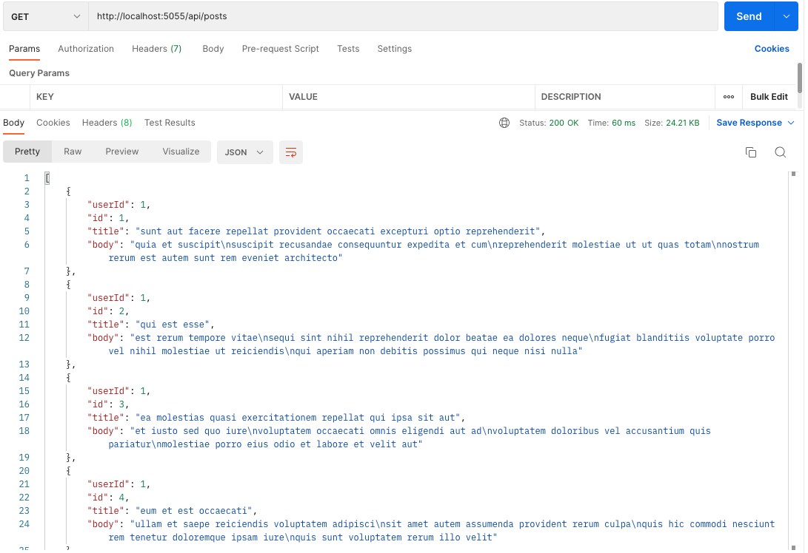
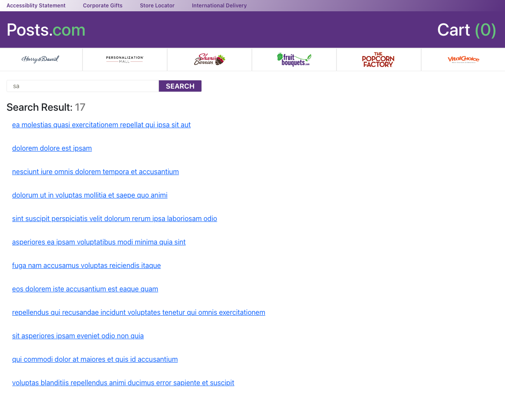
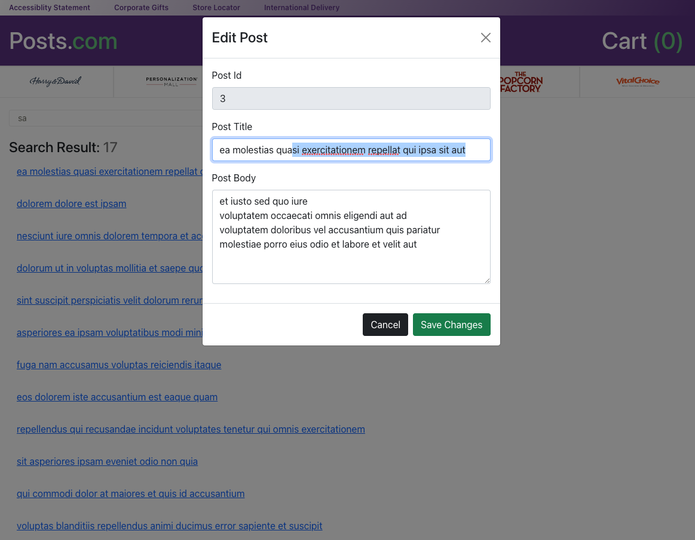

# Plan

### Needs to have:

- Node/Express backend
- React/Redux frontend
- Unit test (front? backend?)

### Nice to haves

- Having fun ( `Ex: Styling or Styling frameworks` )

### Important Notes for myself

- No need for Database
- Don't over-optimize too early with Microservices or Dockers etc.
- Keep it simple
- Save local until page reload (no need to persist)

---

## How to run this app

1. On each folder [server](./server/) and [ui](./ui/) run `npm install`
2. From [server folder](./server/) run `npm run dev`. This will kick off both server and ui.
3. Run test separately
4. Ports: `:5000/api/posts` and `:3000`

---

## What i used to accomplish this app

- React
- Redux Toolkit (`this is nice. even though i mostly used core principles, base redux, in my past projects`)
- Node (+ dependency libraries)
- Express
- React-Bootstrap (`to make some work faster, i would use internal framework, if exists, or create from scratch, if i had more time`)

- [Winston](https://www.npmjs.com/package/winston) for logging
- [Concurrently](https://www.npmjs.com/package/concurrently) and Nodemon (`to make development easier`)

## Does this app has issues?

Yes, it has **specific cases handling (ex: empty data)** issues which could require couple more hours of work.

Overall 5 ui and 1 server unit tests running and passing. Needs more of them.

## Does this app has future?

Yes, app can be improved and developed further. Future is **bright** for this app.

Things can be added for near future: More CRUD API, Persistency of Data, Implement multiple pages, Integrate Database, Page Footer, Language Support, More testing, Web Security, Form Validations, Add Proxy to UI etc.

## Final Notes to 1800Flowers Team

- If you are okay, i can implement autocomplete, fix empty data minor bug and add more unit tests and styling until our meeting next week.
- Please let me know through email (Sarah)

- I didn't know if i had to deploy this app or just send github link. So, sending github link. You can run locally and check the output. For prod, i might need to proxy prod URL on both side.

In case .env is missing on github, this is how its content looks like

```bash
# Port Number
PORT=5055

# Node env
NODE_ENV=development
```

## Screenshots




